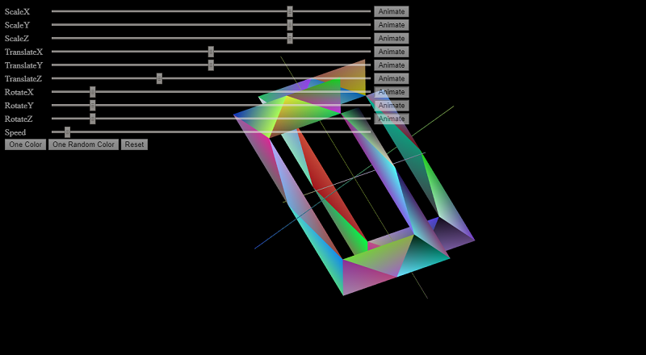

### WebGL Tinker - Learning WebGL and Sharing It

#### Example Links
Here are some links to my examples as I learn WebGL:

[Orthographic 3D][orthographic-3d]

I am learning WebGL.  This repo is an ongoing effort as I do so,
refactoring and expanding various code I come across as I use it to learn.

Right now, just starting off, I am going over the tutorial at
[https://webglfundamentals.org/][webfun].  I owe a huge debt to
Gregg Tavares for his excellent work on that site.  Please
see [LICENSE-webFundamentals.md][webfun-license] for his license info.

Please head on over to the [webglBeginnings][webglBeginnings] folder of this repo
where I am currently actively working with his tutorial and
example code.

I am new to WebGL, but hopefully this repo will grow into it
with me and be a valuable resource for anyone who wishes to
learn, including me!

[orthographic-3d]:  https://xitalogy.github.io/webglTinker/webglBeginnings/018-orthographic-3d/wglb018.html

[webfun]: https://webglfundamentals.org/
[webfun-license]:  https://github.com/aeoril/webglTinker/blob/master/LICENSE-webFundamentals.md
[webglBeginnings]: https://github.com/aeoril/webglTinker/tree/master/webglBeginnings
